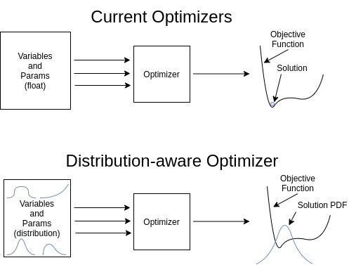

# next_opt
> A collection of potential next-generation optimizer ideas

This repo is meant to be a place for testing radical ideas for optimizers. It is a mental playground of sorts for optimization ideas. Maybe one of the ideas will actually go somewhere someday. Either way, don't expect anything functional, reasonable or finished.

## Dist-Aware-Opt
An optimizer that can natively handle distributions rather than simple float values.

Current optimizers handle only floats for inputs, outputs and parameters. This is preferable in many cases and certainly computationally simpler, but there must be a way to make an optimizer that can handle distributions rather than simple floats. This would enable a whole new class of optimization problems, especially the ever-increasing number that strive to account for stochastic elements in the model. The idea is that we often have far too much variation and uncertainty in an optimization problem to be able to reduce it to a set of simple float values. 

## Time-Aware-Opt
An optimizer that can natively handle time in optimization problems

Current optimizers do not have any understanding of time in the optimization problem. Even fancy optimization packages like [GEKKO](https://gekko.readthedocs.io/en/latest/) end up converting problems into a vast number of algebraic equations and variables that are efficiently solved by float-based optimizers. In these cases a single variable discretized over time becomes an independent variable at each point in the discretization. No special effort is taken to describe the relation of the variables to each other. The relationship between the variables is instead maintained by constraints imposed by collocation or buried in the objective function in the case of shooting-methods.

It could be said that current optimzers do handle the time-correlation of variables through the gradient. This is often done very efficiently through algorithmic differentiation and similar methods. This seems quite different from handling the time-related aspect of the variables directly though.
